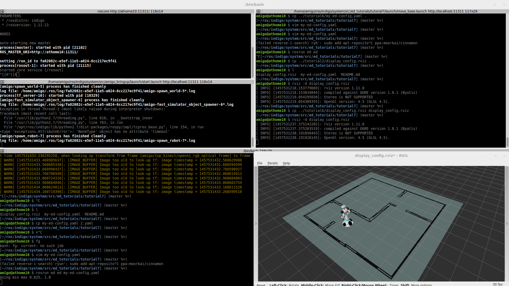
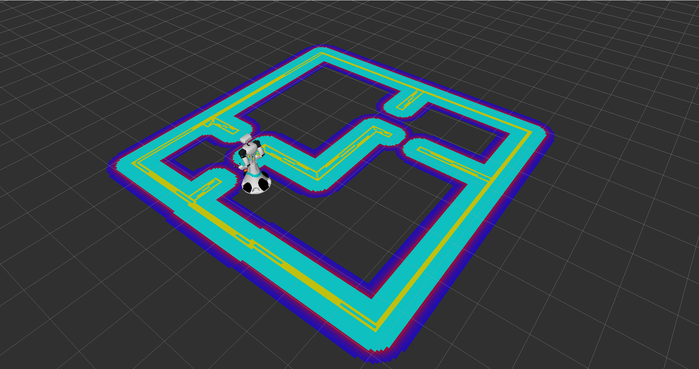
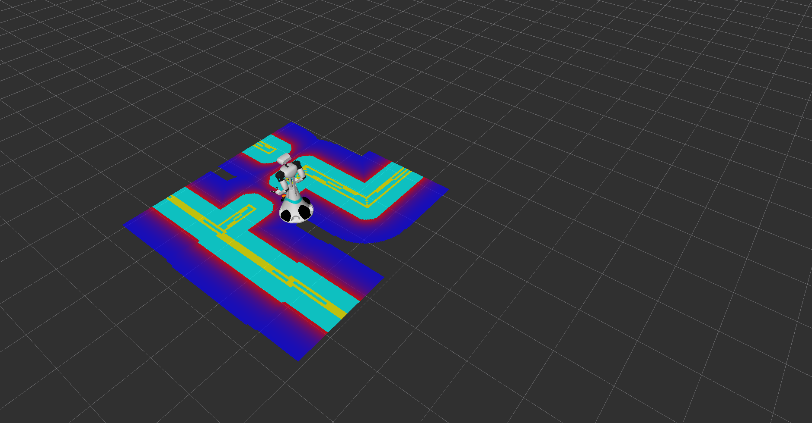

# Tutorial 7) Navigation: ED and [ROS' Move Base](http://wiki.ros.org/move_base)

## Prerequisites

- https://github.com/tue-robotics/ed.git
- https://github.com/tue-robotics/ed_gui_server.git
- https://github.com/tue-robotics/ed_rviz_plugins.git
- https://github.com/tue-robotics/ed_navigation.git

- Up and running move base configured for a static map on topic /ed/navigation/map

## Tutorial

ED can be used in combination with ROS' Move Base or another base navigation framework that accepts a `nav_msgs/OccupancyGrid`. The [ED navigation plugin](https://github.com/tue-robotics/ed_navigation) projects all world model entities down to an occupancy grid which is published. In Move Base, the `static map layer` can be used to integrate this occupancy grid in the costmap.. This can then in turn be used to navigate the robot.

**Add** the following to the **list of plugins** in your configuration file:

<pre>
- name: navigation
  lib: libed_navigation_plugin.so
  parameters:
    occupancy_grid_publisher:
      resolution: 0.05       # Grid cell size in meters
      frame_id: /map         # Frame id of the occupancy grid
      min_z: 0.025           # All entities below min_z and above max_z are not
      max_z: 1.8             # Projected onto the occupancy grid
      default_offset: 0.7    # <-- not used for ROS' Move Base, but needs
                             # to be specified
</pre>

Running ed with this configuration results in the following occupancy grid if
we enable the occupancy grid viewer in RVIZ.

Now we need to configure the costmaps in Move Base to take this occupancy grid
as an input. [This tutorial](http://wiki.ros.org/costmap_2d/Tutorials/Configuring%20Layered%20Costmaps) shows how to configure the layered costmaps that are used from hydro+.

An example global costmap configuration:

<pre>
plugins:
    # Obstacles
    - {name: ed_occupancy_grid,                 type: "costmap_2d::StaticLayer"}
    - {name: robot_footprint,                   type: "costmap_2d::FootprintLayer"}
    - {name: configuration_space,               type: "costmap_2d::InflationLayer"}

# Ed World model layer
ed_occupancy_grid:
    map_topic: /ed/navigation/map
    track_unknown_space: false

# Workspace to configuration space
configuration_space:
    use_footprint: false
    target_cell_value: 254
    dilation_cell_value: 253
    dilation_radius: 0.37 # 2cm margin
    inflation_radius: 0.6
</pre>

An example local costmap configuration:

<pre>
plugins:
    - {name: ed_occupancy_grid,                 type: "costmap_2d::StaticLayer"}
    - {name: robot_footprint,                   type: "costmap_2d::FootprintLayer"}
    - {name: configuration_space,               type: "costmap_2d::InflationLayer"}

# LAYER CONFIGURATION

ed_occupancy_grid:
    map_topic: /ed/navigation/map
    track_unknown_space: true
    use_maximum: true
    lethal_cost_threshold: 99

# Workspace to configuration space
configuration_space:
    use_footprint: false
    target_cell_value: 254
    dilation_cell_value: 253
    dilation_radius: 0.35 # inscribed radius
    inflation_radius: 1.0 # optimization
    cost_scaling_factor: 5.0
</pre>

